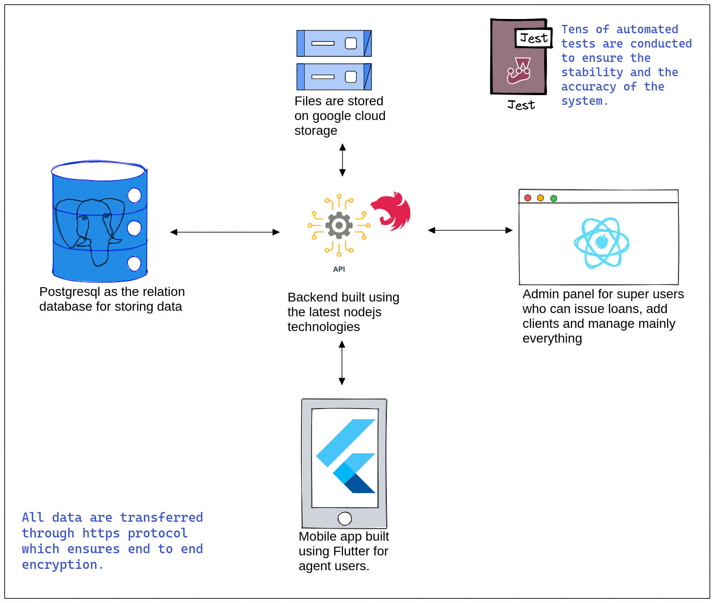

# LMS

## Loan Management System

### Brief intro into Flend Loan Management System

#### 24th March, 2024

---

| LMS-backend                                         | LMS-Admin-Portal                                         | Company-form                                             | Agent App                                            |
| --------------------------------------------------- | -------------------------------------------------------- | -------------------------------------------------------- | ---------------------------------------------------- |
| [github](https://github.com/optomatica/lms-backend) | [github](https://github.com/optomatica/lms-admin-portal) | [github](https://github.com/optomatica/lms-admin-portal) | [github](https://github.com/Optomatica/company-form) |
| [url](https://lms-backend.flend.io/)                | [url](https://lms.flend.io/)                             | [url](https://client.flend.io/)                          | [url](https://github.com/Optomatica/flend-pwa)       |
| [jenkins](http://154.236.187.192:8080/)             |                                                          |                                                          |                                                      |

---

## 

---

# LMS-backend

1. NestJS app built on Fastify.
2. Prisma
3. The work was inspired from an existing solution called [mambu](https://support.mambu.com/docs/interest-types)
4. https://lms-backend.flend.io/

---

## Main Database Models

1. **User**: The one who manages the LMS.
2. **Client**: The loan taker.
3. **Organization/Partner**: Usually the `client` is associated with an organization.
4. **Document**: A `client` or a `user` can have documents which are real files stored on google cloud storage.
5. **Loan product**: It's the type of the `loan`. Any loan should have a `loan product`.
6. **Loan Account (loan)**: The loan entity that's associated with a client.
7. **Loan Transaction**: Any money-related action on the loan is recorded in the `Loan Transaction` table. Actions like `disbursement`, `repayment`,..etc.
8. **Gl-Entry**: Each `Loan Transaction` should have one or many `Gl-entries`.
9. **Installment**: Each `loan account` has many installments.

---

## Main Modules

1. Auth.
2. Users.
3. Organization.
4. Document.
5. Client.
6. Loan Product.
7. Loan Accounts.
8. Loan Management: Provide more functions on loan account.
9. Dashboard: Used mainly by main page in the admin portal.
10. GL(General Ledger)

---

# LMS-Admin-Portal

1. React vite app based on [React-admin framework](https://marmelab.com/react-admin/documentation.html).
2. https://lms.flend.io/

---

## Life Cycle of a loan on the Admin-Portal

1. The `user` creates a `client`.
2. The `user` creates a `loan-product` or reuse an existing one.
3. The `user` creates a `loan-account` using the created `client` and `loan-product`.
4. Request approval.
5. Approve.
6. Disburse.
7. Repay installments.

---

## How does LMS interacts with digital-ID?

1. A contract is sent on client creation.
2. Another contract is send on loan account creation.
3. The `user` can see the status of the contract.

---

# Company-Form

1. Simple react page used to onboard clients.
2. https://client.flend.io/

---

# Good to Know

1. Many loan account default values are inherited from loan product.
2. An `installment` should have `principalDue`, `interestDue`, `penaltyDue` and `feesDue`.
3. A `loan account` should have `principal`, `interest`, `penalty` and `fees` in 2 variances (due and balance)

---

# General Ledger intro

**General Ledger**: Book keeping for accounting transactions.

---

## Account Types

1. Asset
2. Liability
3. Income
4. Expense

---

## Accounts

| Account Name               | Account Type | Description                                 |
| -------------------------- | ------------ | ------------------------------------------- |
| Portfolio Control          | Asset        | Money outside Flend                         |
| Transaction Source         | Asset        | Money inside Flend                          |
| Writeoff Expense           | Expense      | Expenses from writeoff                      |
| Partner Commission Expense | Expense      | Expenses from partner commission percentage |
| Interest Income            | Income       | Income coming from applied interest         |
| Fee Income                 | Income       | Income coming from applied fees             |
| Penalty Income             | Income       | Income coming from applied penalties        |

---

## Operations

|           | Debit    | Credit   |
| --------- | -------- | -------- |
| Asset     | Increase | Decrease |
| Liability | Decrease | Increase |
| Income    | Decrease | Increase |
| Expense   | Increase | Decrease |

---

## GL transaction corresponding to Transactions

1. Disbursement

   1. Debit `Portfolio Control`
   2. Credit `Transaction Source`

2. Write-Off

   1. Debit `Write off Expense`
   2. Credit `Portfolio Control`

---

3. Repayment
   1. Debit `Transaction Source`
   2. Credit `Portfolio Control`
   3. Debit `Transaction Source`
   4. Credit `Fee Income`
   5. Debit `Transaction Source`
   6. Credit `Interest Income`
   7. Debit `Transaction Source`
   8. Credit `Penalty Income`
   9. Debit `Partner Commission Expense`
   10. Credit `Transaction Source`
